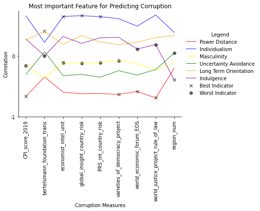

# Hofstede's 6 Dimensions and Corruption
## Executive Summary

For companies working internationally, it is important to be aware of the corruption they may need to deal with in new countries. However, data is not always available to make a meaningful comparison and therefore, Hofstede's 6 dimensions will be compared with a variety of different corruption ratings to see if any correlate. Later, this can be used to develop a predictor.

Key insights:

- There are two pairs of Hofstede values with strong negative correlation (long term orientation and indulgence and individualism and power distance).
- The corruption ratings strongly correlate aside fom the Bertelsmann index.
- "Power distance" correlated the highest with 4 of the corruption rankings.
- "Masculinity" showed the least correlation with the corruption rankings.
- The "CPI Score 2019" was the most useful corruption ranking (best indicator of the correlation trend).
- "Bertelsmann" was the least useful corruption ranking.

[View Notebook](https://github.com/mthorp363/culture_and_corruption/blob/master/Main.ipynb)

Data from [Transparency International's CPI](https://www.transparency.org/en/cpi/2019/results/table) and [Hofstede's 6 dimensions of culture](https://geerthofstede.com/research-and-vsm/dimension-data-matrix/).
